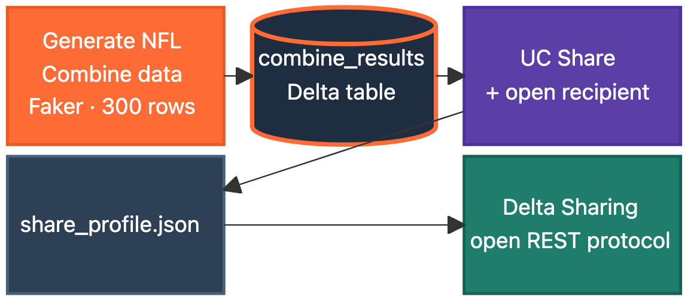
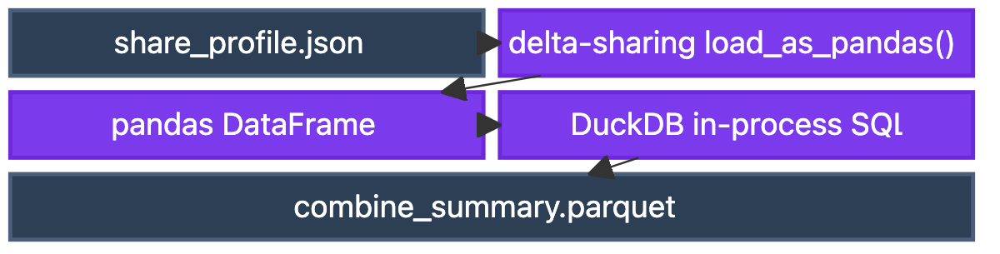
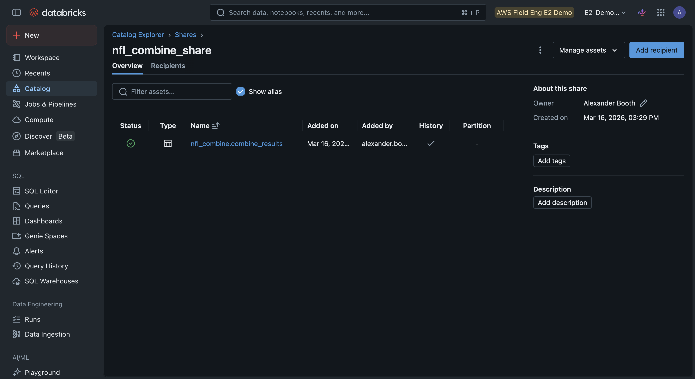
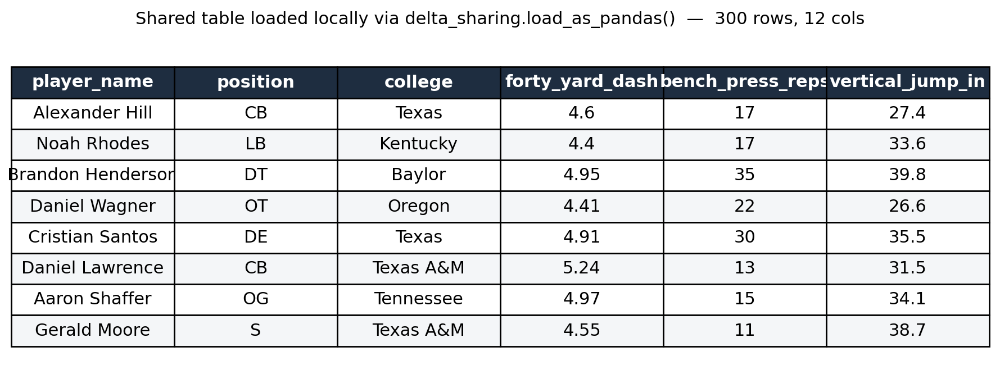
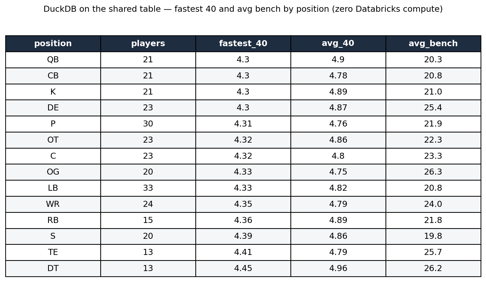
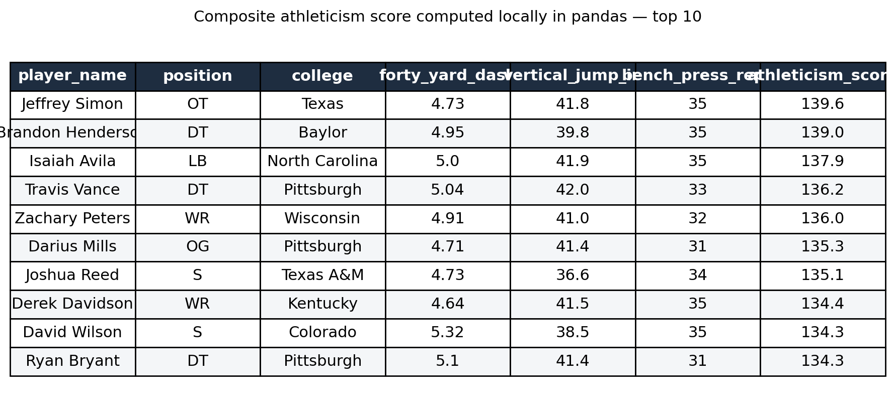

# Query Governed Delta Tables From Local Python: No Warehouse, No Cluster

*Delta Sharing is an open protocol. A partner can query your governed tables with DuckDB and pandas, from a laptop, with zero Databricks compute.*

Here's a thing most people assume and it's wrong: that to query a Delta table living in someone's Databricks, you need Databricks too. A workspace, a warehouse, a cluster, a login.

You don't. [Delta Sharing](https://docs.databricks.com/en/delta-sharing/index.html) is an open protocol, and the consumer side is just three Python libraries and a single JSON file. No warehouse spins up. No cluster. The partner doesn't even need a Databricks account.

This demo shows the whole loop. A provider generates a small reference dataset, shares it through [Unity Catalog](https://docs.databricks.com/en/data-governance/unity-catalog/index.html), and a consumer queries it locally with DuckDB and pandas. The dataset consists of NFL Combine results because everyone understands a 40-yard dash.



*Provider side: generate, land in Delta, share through Unity Catalog.*



*Consumer side: one JSON file, then pandas and DuckDB locally, with zero Databricks compute.*

## The provider: generate, then share

The first two notebooks live on the Databricks side. One generates 300 NFL Combine records with position-aware profiles, so the offensive linemen are big and slow, and the corners are small and fast, then writes them to a [Delta table](https://docs.databricks.com/en/delta/index.html).

```python
POSITION_PROFILES = {
    "QB": (73, 77, 210, 240),   # height_in lo/hi, weight_lbs lo/hi
    "WR": (70, 76, 175, 215),
    "OT": (76, 80, 295, 340),
    "CB": (69, 73, 180, 205),
}
```

The second notebook does the sharing, and it's all SQL. Create a share, add the table, create a recipient, and grant it access. Then pull the recipient's activation profile, a small JSON file with an endpoint and a bearer token.

```sql
CREATE SHARE IF NOT EXISTS nfl_combine_share;
ALTER SHARE nfl_combine_share ADD TABLE alexander_booth.nfl_combine.combine_results;
CREATE RECIPIENT nfl_combine_external_reader;
GRANT SELECT ON SHARE nfl_combine_share TO RECIPIENT nfl_combine_external_reader;
```

That `share_profile.json` is the entire handoff. You send it to a partner, and they're done. Everything they can see, and nothing they can't, is governed right here in Unity Catalog.



*The share in Catalog Explorer: the shared `combine_results` table, the recipient, and the grant. The whole access policy lives here.*

## The consumer: a laptop, no Databricks

The third notebook is the point of the whole thing, and notice what's *not* in it. No `DatabricksSession`. No cluster config. No warehouse. Just the open-source [`delta-sharing`](https://github.com/delta-io/delta-sharing) client pointed at the profile file.

```python
import delta_sharing

table_url = "share_profile.json#nfl_combine_share.nfl_combine.combine_results"
df = delta_sharing.load_as_pandas(table_url)   # straight to a DataFrame, no compute
```

One call and the shared table is a pandas DataFrame.



*300 rows, 12 columns, pulled straight from the share into a local DataFrame. No warehouse touched.*

From there, you can stay in pandas, or, my preference, for anything SQL-shaped, hand it to [DuckDB](https://duckdb.org/) and write real queries against it locally.

```python
import duckdb
con = duckdb.connect()
con.sql("""
    SELECT position, COUNT(*) AS players,
           ROUND(MIN(forty_yard_dash), 2) AS fastest_40,
           ROUND(AVG(bench_press_reps), 1) AS avg_bench
    FROM df
    GROUP BY position
    ORDER BY fastest_40
""").show()
```

Full SQL. Group by, filter, aggregate, join. All in-process, all on the laptop, all against data that's governed back in Unity Catalog.

```python
con.sql("""
    SELECT player_name, college, forty_yard_dash
    FROM df WHERE position = 'WR' AND forty_yard_dash < 4.5
    ORDER BY forty_yard_dash
""").show()
```



*Full SQL over shared data, running in-process on a laptop. Kickers post the fastest 40s; defensive tackles the slowest.*

And because it's just a DataFrame once it lands, you can layer on whatever analysis you like. A quick composite athleticism score in pandas, top 15:



*A derived metric computed locally from the shared columns. No round trip, no warehouse.*

## When this pattern wins

This is not how you'd serve a billion-row fact table. `load_as_pandas` pulls the whole thing into memory, and there's no predicate pushdown, so you fetch before you filter. The README is honest about it.

Where it wins is the very common case that the heavyweight tools handle badly: small, governed reference data that needs to reach people outside your walls.

* A partner who doesn't run Databricks and shouldn't have to.  
* Reference tables: a product hierarchy, a customer master, and a metrics lookup.  
* A data science notebook that wants SQL and pandas without paying for a warehouse to idle.

The consumer's bill for all of it is zero. The provider's governance for all of it is total. That's the trade Delta Sharing makes, and for reference data, it's the right one.

## The point

Open protocols beat proprietary ones for exactly this reason. You define and govern the data once, in Unity Catalog, and the consumer brings whatever tool they like. DuckDB here, but it could be pandas, Polars, or Spark on the other side of the world.

No warehouse. No cluster. No account. One JSON file and a governed table on the other end. That's a surprisingly powerful way to move data, and most teams don't realize it's already sitting in the platform they own.

---

*The full demo (four notebooks) lives in the [`delta-sharing-duckdb`](https://github.com/ABoothInTheWild/databricks_demos/tree/main/delta-sharing-duckdb) directory. The NFL Combine data is entirely synthetic, generated locally for demonstration.*
