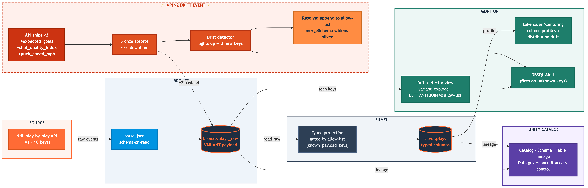
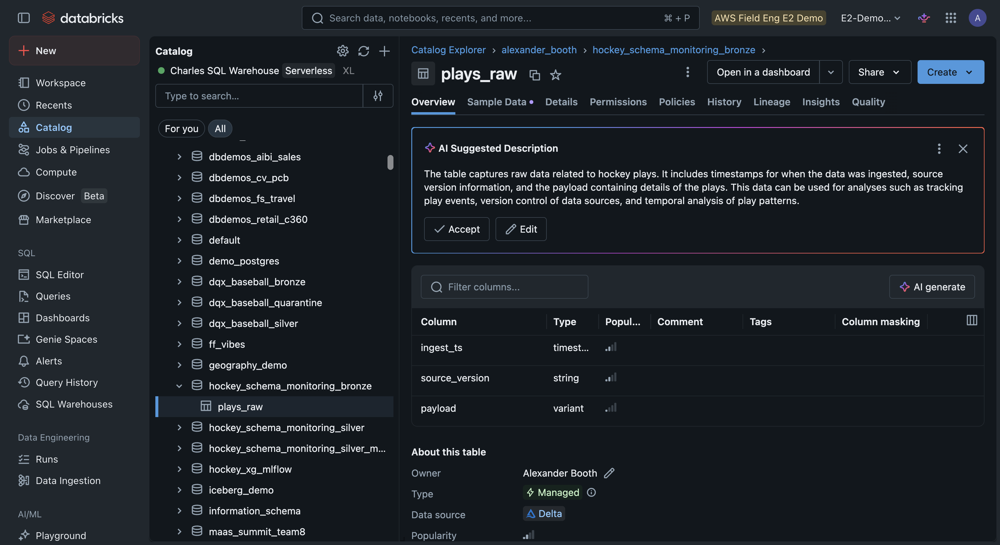
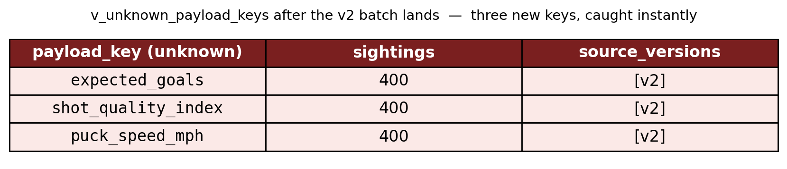
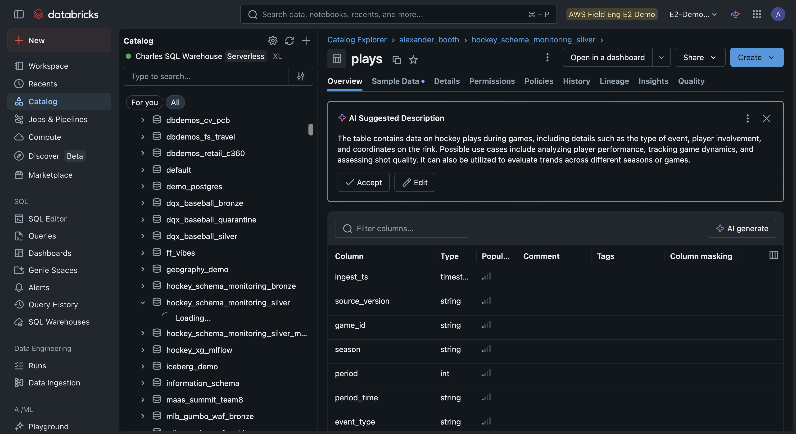

# Catch Schema Drift Before It Breaks You: VARIANT, a Drift Detector, and Alerts on Databricks

*An upstream API adds three fields. Your bronze layer shrugs, a detector lights up, an alert fires, and silver widens in place. No 2 a.m. page.*

Here is the failure every data engineer has lived through. An upstream API quietly changes. A new field appears, or an old one gets renamed. Nobody told you. Your strict pipeline either crashes at 2 a.m. or, worse, silently drops new data and keeps running as if nothing happened. By the time anyone notices, a dashboard has been wrong for a week, and debugging starts from a stack trace.

This demo builds the opposite of that. A pipeline that absorbs the change, tells you exactly what changed, and gives you a one-step path to adopt it. The example feed is NHL play-by-play, but the pattern is the point, and it works for any source you don't control.




## Bronze that can't break: VARIANT

The foundation is a single design choice. Bronze stores the raw payload as a [`VARIANT`](https://docs.databricks.com/en/semi-structured/variant.html) column instead of a fixed schema.

```python
df = (spark.createDataFrame(rows, schema=schema)
        .withColumn("ingest_ts", F.current_timestamp())
        .withColumn("payload",   F.expr("parse_json(payload_json)")))
df.write.mode("overwrite").option("overwriteSchema","true").saveAsTable(BRONZE_TABLE)
```

VARIANT is schema-on-read. The API can hand you 10 fields today and 13 tomorrow, and bronze ingests both without a code change and without dropping anything. That's the whole reason ingestion never breaks: bronze made no promises about shape.



*The bronze table stores the raw API payload as a single VARIANT column. New fields just slip into it; the schema never changes.*

## Silver: typed, and deliberately picky

Bronze is permissive. Silver is the opposite, on purpose. It projects only the fields it has been told about, pulled from the VARIANT via dot-path and cast to real types.

```sql
SELECT
    payload:game_id::string    AS game_id,
    payload:period::int        AS period,
    payload:event_type::string AS event_type,
    payload:x_coord::double    AS x_coord
FROM bronze.plays_raw
```

The list of fields silver is allowed to project lives in a table, `known_payload_keys`. Ten keys to start. Anything not on that list does not become a column. That's the contract: bronze takes everything, silver takes only what's been reviewed.

## The detector: what changed, exactly

This is the clever bit, and it's one query. Walk every top-level key in every payload with `variant_explode`, then anti-join against the allow-list. Whatever's left is new.

```sql
WITH exploded AS (
    SELECT ingest_ts, kv.key AS payload_key
    FROM bronze.plays_raw, LATERAL variant_explode(payload) AS kv
)
SELECT payload_key, COUNT(*) AS sightings,
       MIN(ingest_ts) AS first_seen, MAX(ingest_ts) AS last_seen
FROM exploded e
LEFT ANTI JOIN known_payload_keys k ON k.key = e.payload_key
GROUP BY payload_key
```

No parsing, no schema inference job, no guesswork. The view returns one row per unknown key, including how many times it's been seen and when it first appeared. With v1 data, it returns nothing.

## The alarm: a DBSQL Alert

Point a [DBSQL Alert](https://docs.databricks.com/en/sql/user/alerts/index.html) at that view with a condition of "rows > 0" and a five-minute schedule. The moment an unknown key appears, the alert fires to email, Slack, or PagerDuty.

There's also a second, complementary signal: a [Lakehouse Monitor](https://docs.databricks.com/en/lakehouse-monitoring/index.html) on `silver.plays` in profile mode. The drift detector catches *new keys*. The monitor catches *distribution shifts in existing columns*, the case where a field doesn't change shape but its values go sideways. Two detectors, two different blind spots covered.

## The event: the API ships v2

Now the demo does the thing that usually ruins a Friday. A new batch of events arrives tagged `v2`, carrying three fields that didn't exist before.

```python
def make_play_v2(n):
    return { **v1_keys(n),
        "expected_goals":     round(rng.uniform(0.01, 0.45), 3),
        "shot_quality_index": round(rng.uniform(0.0, 1.0), 3),
        "puck_speed_mph":     round(rng.uniform(40.0, 105.0), 1) }
```

Watch what happens. Bronze ingests all 400 v2 events without complaint, because VARIANT doesn't care. Silver keeps running on its ten known keys, unaffected. And the drift detector immediately returns three rows: `expected_goals`, `shot_quality_index`, `puck_speed_mph`, each seen 400 times. The alert fires. You know within minutes, not after a dashboard rots.



*The drift detector lights up the instant the v2 batch lands: three unknown keys, 400 sightings each. A DBSQL Alert on this view (condition: rows > 0) emails the team within minutes.*

## The fix: widen on purpose, in place

The recovery is a two-step decision, not a fire drill. Add the three reviewed keys to the allow-list, then re-run silver. [Delta](https://docs.databricks.com/en/delta/index.html)'s `mergeSchema` widens the table in place: old rows get NULL for the new columns, new rows get values, nothing is rewritten, and nothing downstream breaks.

```python
NEW_KEYS = ["expected_goals", "shot_quality_index", "puck_speed_mph"]
(spark.createDataFrame([Row(key=k) for k in NEW_KEYS])
      .write.mode("append").saveAsTable(KNOWN_KEYS_TBL))

silver.write.mode("overwrite").option("overwriteSchema","true").saveAsTable(SILVER_TABLE)
```

Run a coverage check, and the story is clean: the v1 rows show 0% population on the new columns, the v2 rows show 100%. The drift detector goes back to empty. The alert clears. Silver is wider, history is intact, and you adopted the change on your own schedule.



*Silver projects only the reviewed keys into typed columns. After the allow-list update, `mergeSchema` widens it in place to absorb the three new fields.*

## The point

The trick isn't any one feature. It's three of them covering each other.

VARIANT means ingestion can't break on a shape change. The `variant_explode` detector means you always know precisely what changed and when. The DBSQL Alert means you hear about it in minutes. And `mergeSchema` means adopting the change is a deliberate, in-place edit rather than a rebuild.

Schema drift is not an exotic problem. It's the most ordinary thing that goes wrong with data you don't own. This is how you make it a notification instead of an outage.

---

*The full demo (six notebooks: four to set up, two to run live) lives in the [hockey-schema-monitoring](https://github.com/ABoothInTheWild/databricks_demos/tree/main/hockey-schema-monitoring) directory. The play-by-play events are entirely synthetic and generated locally for demonstration.*
