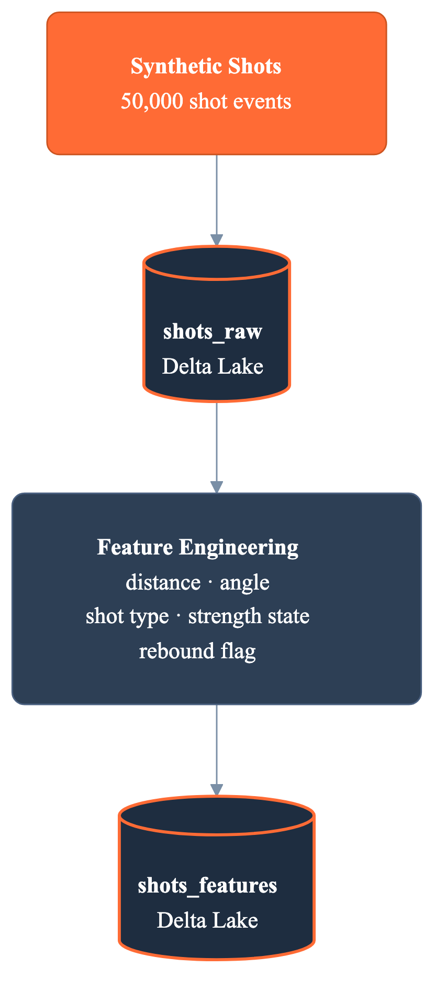
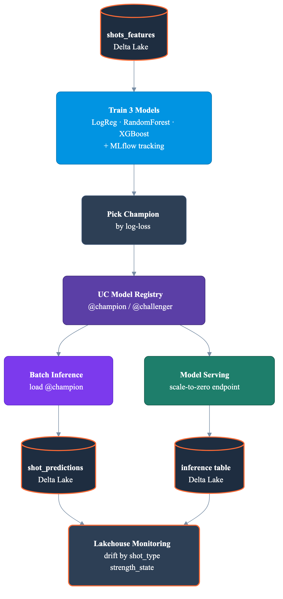
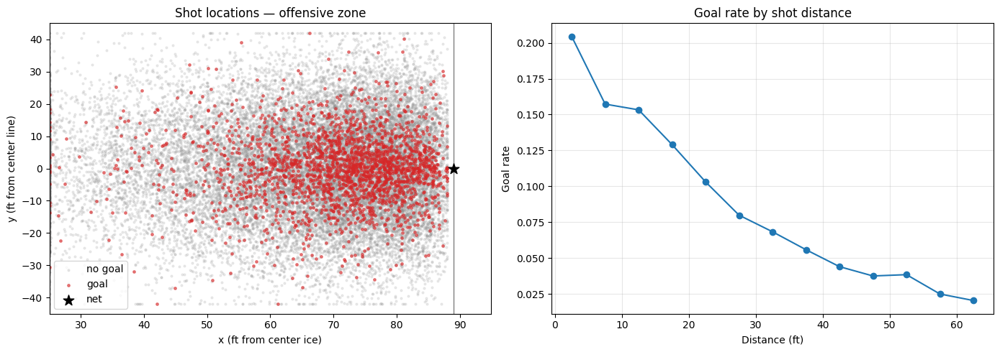
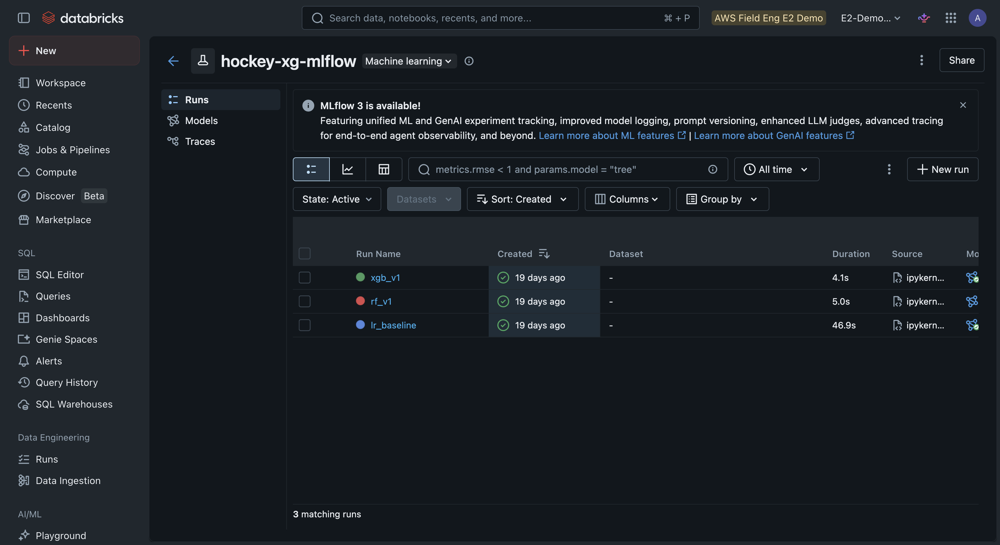
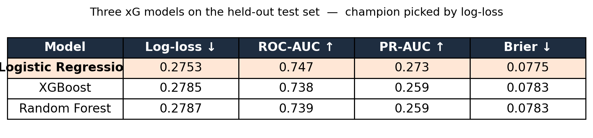
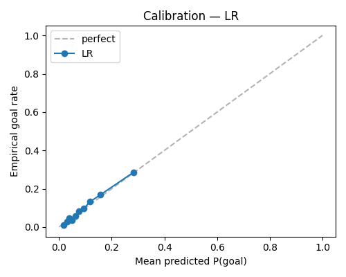
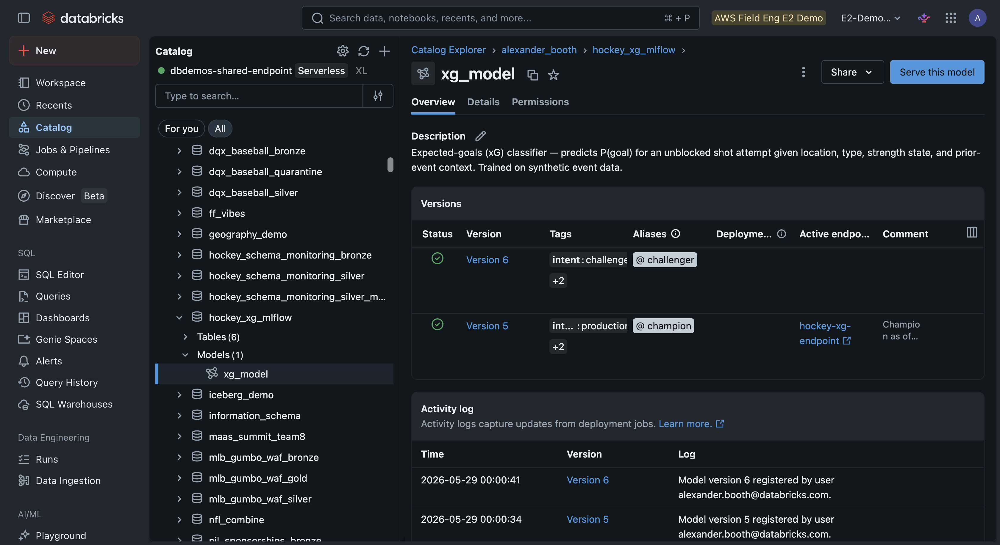
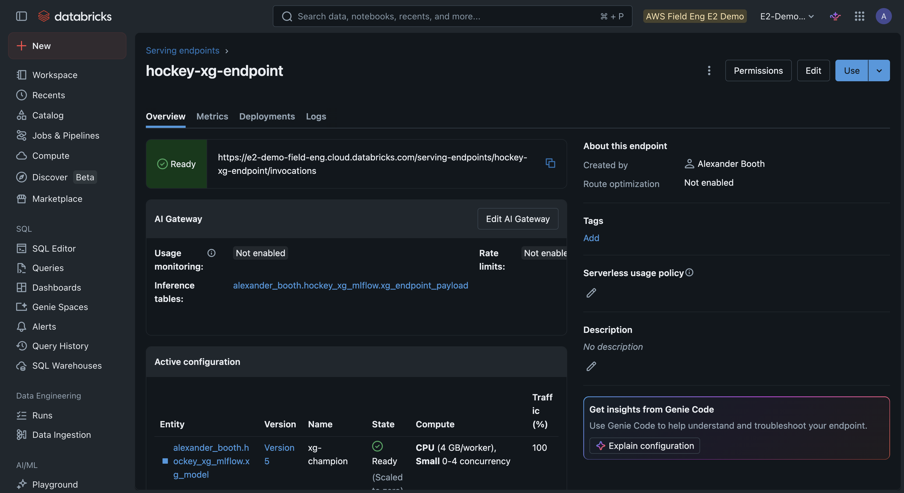
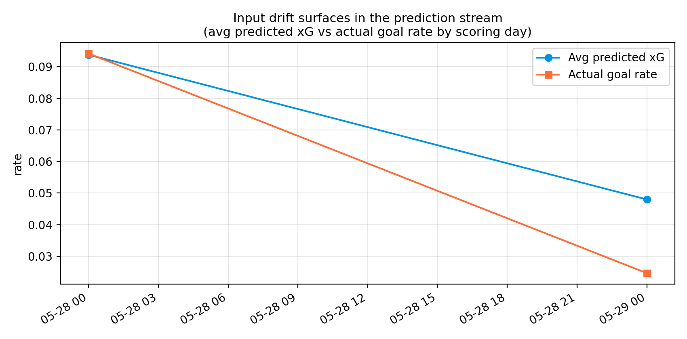

# Expected Goals, End-to-End: An MLOps Pipeline for Hockey on Databricks

*From synthetic shots to a calibrated xG model — governed in Unity Catalog, served behind an endpoint, and watched for drift.*

Every hockey analytics team eventually reaches the same realization. Counting shots is a lie.

A team can fire 35 pucks from the perimeter and lose to a team that took 18 from the slot. Shot volume tells you almost nothing. Shot *quality* is the thing, and the metric that captures it is expected goals: the probability that a given shot becomes a goal, based on where it was taken, how it was taken, and the situation.

Building an xG model is the easy part. A logistic regression on shot distance and angle gets you most of the way there in an afternoon. The hard part is everything around it. Tracking the experiments. Picking a winner you can defend. Governing the model so the version in production is the version you think it is. Serving it. And knowing when the league shifts under you and your model quietly goes stale.

This demo does all of that on Databricks, in seven notebooks, with no external API and no hockey knowledge required to follow along.



*The data pipeline: synthetic shots to leakage-safe features.*



*The ML lifecycle: train, govern, serve, and watch for drift.*

## The data: 50,000 synthetic shots

The first notebook generates a season's worth of shots. About 50,000 of them, across 32 teams, each with a hidden ground-truth probability of becoming a goal. That hidden function is the point. Because we know the true P(goal) for every shot, we can check later whether the model's probabilities actually mean something.

The overall goal rate lands at 9.42%, which is squarely where real NHL shooting percentage sits. Synthetic data gets a bad reputation, but here it buys three things: it's reproducible, it carries no licensing baggage, and it gives us a known answer to grade against. Swap in your own tracking feed later and nothing downstream changes.

## Features a hockey fan would recognize

The second notebook turns raw shots into model features, and each one is something you could explain from the broadcast booth.

```python
feat = (src
    .withColumn("distance_sq", F.col("distance_ft") ** 2)
    .withColumn("angle_sq", F.col("angle_deg") ** 2)
    .withColumn("is_high_danger",
                ((F.col("distance_ft") <= 20.0) & (F.col("angle_deg") <= 30.0)).cast("int"))
    .withColumn("rebound_dist", F.col("rebound").cast("int") * F.col("distance_ft"))
)
```

Distance and angle to the net. Their squared terms, because the relationship is not linear. One-hot encodings for shot type and strength state. A rebound flag, and a rebound-times-distance interaction, because a rebound from the doorstep is a very different animal than a rebound from the blue line.

The signal is real, and it shows up immediately. Goal rate climbs as shots get closer to the net, and it spikes for the shot types you'd expect. Tip-ins convert at 13.5%, rebounds at 15.1%, and an empty-net 6-on-5 sits at a frankly silly 45.7% against the 8.6% you get at even strength.



*The classic hockey analytics view: the slot lights up, the perimeter goes cold. This is the signal the model learns.*

## Three models, one experiment

The third notebook trains three candidates that each output a probability the shot is a goal: logistic regression, random forest, and XGBoost. Everything gets logged to [MLflow](https://docs.databricks.com/en/mlflow/index.html). Parameters, metrics, an ROC curve, and the one I care about most, a calibration curve.

```python
with mlflow.start_run(run_name="xgb_v1"):
    mlflow.set_tag("model_family", "xgboost")
    xgb_clf.fit(X_train, y_train)
    mlflow.log_metric("test_roc_auc", roc_auc_score(y_test, proba))
    mlflow.log_metric("test_log_loss", log_loss(y_test, proba))
    mlflow.log_figure(fig_calibration, "calibration_curve.png")
    mlflow.pyfunc.log_model("model", python_model=XGPredictor(xgb_clf), signature=sig)
```

That `XGPredictor` wrapper matters. By default, a classifier hands you a label, 0 or 1. For xG, we want the probability, so a tiny pyfunc wrapper overrides `predict` to return P(goal):

```python
class XGPredictor(mlflow.pyfunc.PythonModel):
    def __init__(self, classifier):
        self.classifier = classifier
    def predict(self, context, model_input):
        return self.classifier.predict_proba(model_input)[:, 1]   # P(goal), not the label
```



*All three candidates tracked in one MLflow experiment, logged from a local notebook running on Serverless.*

Here is the part people find annoying and I find reassuring: the simplest model won. Logistic regression achieved the lowest log-loss, 0.2753, edging out both the random forest (0.2787) and XGBoost (0.2785). On a problem this well-behaved, the fancy models had nothing extra to find.



*The held-out scoreboard. Logistic regression wins on log-loss, the metric that actually matters for a probability you intend to trust.*

And log-loss, not accuracy, is the right scoreboard. An xG number is only useful if it's *calibrated*: when the model says 0.30, that group of shots should go in about 30% of the time. A model can have great accuracy and lie about its probabilities. Calibration is what makes the output trustworthy.



*The champion's calibration curve: predicted probability against actual goal rate. Hugging the diagonal means the numbers mean what they say.*

## Pick a champion, govern it in Unity Catalog

The fourth notebook holds out a slice of data the models never saw, scores all three, picks the winner by log-loss, and registers it to the [Unity Catalog model registry](https://docs.databricks.com/en/machine-learning/manage-model-lifecycle/index.html) with semantic aliases.

```python
champ_mv = mlflow.register_model(f"runs:/{champion_run.info.run_id}/model", MODEL_NAME)
client.set_registered_model_alias(MODEL_NAME, "champion",   champ_mv.version)
client.set_registered_model_alias(MODEL_NAME, "challenger", chal_mv.version)
```

`@champion` and `@challenger` are the whole trick. Production code never hard-codes a version number. It asks for `@champion` and gets whatever the latest blessed model is. Promoting a new model is a one-line alias flip, and rolling back is the same line in reverse.



*Governed like any other UC asset: versions, the `@champion` and `@challenger` aliases, the production tag, and the linked serving endpoint. Promotion is one alias change.*

## Serve it, then query it

The fifth and sixth notebooks take the champion to production. Batch inference loads it by alias, not by version:

```python
model = mlflow.pyfunc.load_model(f"models:/{MODEL_NAME}@champion")
pdf["xg"] = model.predict(X)
# When @champion flips to a new version, this line picks it up. No code change.
```

Then we set up a real-time [serving endpoint](https://docs.databricks.com/en/machine-learning/model-serving/index.html) with scale-to-zero, so it costs nothing while idle, and turn on the inference table so every request and response is logged automatically for monitoring.

```python
served = ServedEntityInput(entity_name=MODEL_NAME, entity_version=str(champ.version),
                           workload_size="Small", scale_to_zero_enabled=True)
w.serving_endpoints.create(name=ENDPOINT, config=cfg, ai_gateway=ai_gateway)
```

The sanity check is the fun part. Feed it a high-danger rebound from the slot, and it returns an xG of 0.314. Feed it a low-danger slap shot from the point, and it returns 0.018. The model learned hockey.



*The champion behind a scale-to-zero serving endpoint, with the inference table capturing every request for monitoring.*

## Watch it drift

The last notebook is the one most demos skip. Models don't fail loudly. They rot quietly, as the world stops looking like the training data.

So we simulate exactly that. A new batch of 8,000 shots arrives, but skewed: more perimeter shots, fewer rebounds, more penalty kill. The goal rate drops from 9.42% to 2.46%. We score it with `@champion` and let [Lakehouse Monitoring](https://docs.databricks.com/en/lakehouse-monitoring/index.html) do its job.

```python
inference_log = MonitorInferenceLog(
    timestamp_col="scored_at_utc",
    granularities=["1 day"],
    prediction_col="prediction",
    problem_type=MonitorInferenceLogProblemType.PROBLEM_TYPE_CLASSIFICATION,
)
w.quality_monitors.create(table_name=PRED_TABLE, inference_log=inference_log,
                          slicing_exprs=["shot_type", "strength_state"])
```

The monitor profiles the prediction stream, compares it to baseline, and slices the drift by `shot_type` and `strength_state`, so you don't just learn *that* the input shifted, you learn *where*. That's the difference between an alert that says "something's wrong" and one that says "your perimeter-shot distribution moved, go look."



*Drift, made visible. On the drifted batch, the average predicted xG and the actual goal rate both fall off a cliff. That's the signal the monitor exists to catch.*

## The point

The xG model here is deliberately simple. Logistic regression on a couple of dozen features. You could read every line of it.

The pipeline around the model is the part that's actually production: experiments tracked in MLflow, a champion governed in Unity Catalog, a scale-to-zero endpoint, inference logging, and a monitor that catches drift and tells you where it happened. Point the first notebook at a real tracking feed instead of the synthetic generator, and the entire story downstream is unchanged.

That's the whole pitch. The model is the easy 20%. Databricks is how you handle the other 80% without having to build it all yourself.

---

*The full demo (seven notebooks, all runnable on [Databricks Serverless](https://docs.databricks.com/en/dev-tools/databricks-connect/index.html)) lives in the [hockey-xg-mlflow](https://github.com/ABoothInTheWild/databricks_demos/tree/main/hockey-xg-mlflow) directory. The shot data used throughout is entirely synthetic and generated locally for demonstration.*
