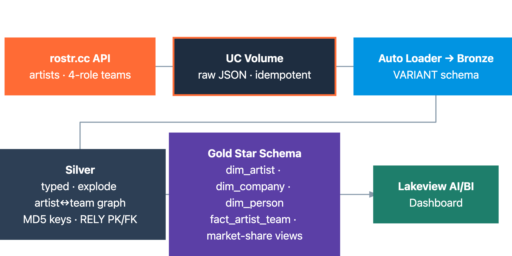
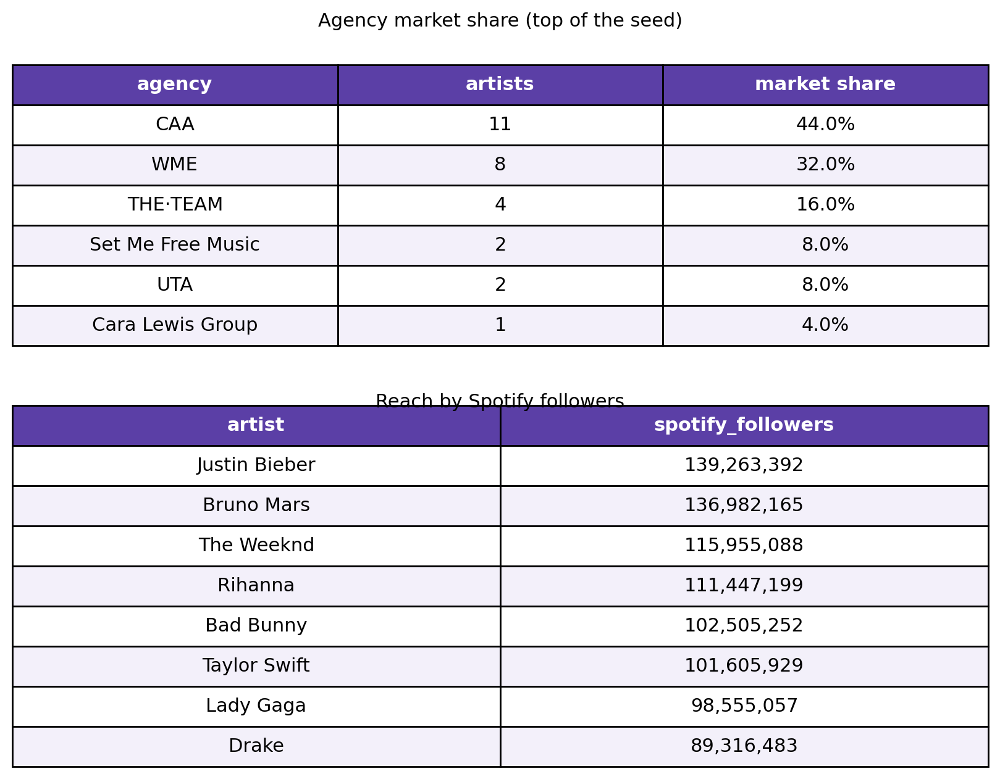

# From a Music API to a Governed Data Product: The rostr Pipeline on Databricks

*Ingest an evolving music-industry API, run it through a medallion, and land a star schema plus a dashboard that answers "who represents whom" — six notebooks, end to end.*

The music business runs on relationships. Which agency books an artist, which manager handles their career, which label puts out the records, and which specific person at each firm is on the account. The rostr.cc API exposes that whole graph. The problem, as always, is that an API is not a data product. It hands back deeply nested, ever-changing JSON, and turning that into something a label's analytics team can query is the work.

This demo does it on Databricks in six notebooks: the rostr API to a governed, BI-ready star schema, plus a Lakeview dashboard on top. Twenty-eight artists, eighty companies, the people behind them, and the relationships that connect them.



## Ingest: fan out, and don't repeat yourself

The first notebook starts from a seed list of artists and fans out, pulling each artist's detail and their four-role team (agency, management, label, publisher) into a [Unity Catalog Volume](https://docs.databricks.com/en/volumes/index.html) as raw JSON. It's idempotent: a file that has already landed is skipped, so a rerun doesn't hammer the API.

```python
def ingest_artist(name, handle):
    path = f"{ARTISTS_DIR}/{handle}.json"
    if not FORCE_REFRESH and already_uploaded(path):
        return "skipped"
    upload(path, rostr.get_artist(handle)); return "wrote"
```

## Bronze: land it as VARIANT

[Auto Loader](https://docs.databricks.com/en/ingestion/cloud-object-storage/auto-loader/index.html) reads the JSON and stores each payload as a [`VARIANT`](https://docs.databricks.com/en/semi-structured/variant.html) column. The rostr API is third-party and evolving, so bronze makes no promises about shape; new fields just land.

```python
(spark.readStream.format("cloudFiles")
    .option("cloudFiles.format", "json")
    .load(source_dir)
    .selectExpr("PARSE_JSON(TO_JSON(STRUCT(*))) AS data",
                "current_timestamp() AS _ingestion_timestamp",
                "_metadata.file_path AS _source_file")
    .writeStream.trigger(availableNow=True).toTable(target_table))
```

## Silver: untangle the graph

Silver is where the nested JSON becomes a relational model. The team payload is the hard part: each artist has multiple companies, each company has multiple people. We explode it out into typed, normalized tables with `from_json` and `LATERAL VIEW EXPLODE`.

```sql
SELECT artist_handle, role, entry.company, entry.team
FROM bronze_team
LATERAL VIEW EXPLODE(
    FROM_JSON(data:entries::string,
        'ARRAY<STRUCT<company:STRUCT<rostrId:STRING,name:STRING,...>, team:ARRAY<...>>>')
) AS entry
```

MD5 surrogate keys make every write deterministic, and we declare primary and foreign keys with [`RELY`](https://docs.databricks.com/en/tables/constraints.html), which render an ERD in [Catalog Explorer](https://docs.databricks.com/en/catalog-explorer/index.html) and give the optimizer something to work with. The result is five clean tables: artists, companies, the full company rosters, and the two bridge tables that capture which firm (and which person) represents which artist.

## Gold: a star schema, and a market-share view

Gold collapses silver into a star: dimensions for artist, company, and person; a fact table for artist-team relationships; and a handful of analytical views that answer the questions a music exec actually asks.

```sql
CREATE OR REPLACE VIEW v_agency_market_share AS
SELECT company_name AS agency,
       COUNT(DISTINCT artist_handle) AS artists_represented,
       ROUND(COUNT(*) * 100.0 / (SELECT COUNT(DISTINCT artist_handle)
              FROM silver_artist_company WHERE role='AGENCY'), 1) AS market_share_pct
FROM silver_artist_company WHERE role = 'AGENCY'
GROUP BY company_name ORDER BY artists_represented DESC
```

## Consume: a dashboard as code

The last notebook builds a [Lakeview AI/BI dashboard](https://docs.databricks.com/en/dashboards/index.html) entirely from the SDK, no clicking: KPI counters for artists, companies, and people, an agency market-share pie, a top-managers table, and a Spotify-reach bar. It's defined in the notebook and published in place, so it lives in version control like the rest of the pipeline.


*The numbers the dashboard is built on, straight from the gold views: two agencies represent three-quarters of the seed, and the Spotify-reach leaderboard runs from Justin Bieber down.*

And the data has a story. Across the seed of top artists, CAA represents 44% of them and WME another 32%. Two agencies, three-quarters of the roster. That's a real finding falling out of a demo pipeline, which is the whole point of getting the data into shape: the analytics become trivial once the model is right.

## The point

The relationships were public in the API the entire time. The value is the governed product around them: typed, deduplicated, constrained, lineage-tracked, and sitting behind a dashboard that a non-engineer can read.

None of it is music-specific. Point the first notebook at a different API, keep the [medallion](https://docs.databricks.com/en/lakehouse/medallion.html) and the star schema, and you've shipped a governed data product for whatever domain you're in. The hard part is built once; only the ingest knows it's about music.

---

*The full demo (six notebooks, runnable locally via [Databricks Connect](https://docs.databricks.com/en/dev-tools/databricks-connect/index.html) or in-workspace) lives in the [`rostr-artist-team-pipeline`](https://github.com/ABoothInTheWild/databricks_demos/tree/main/rostr-artist-team-pipeline) directory. It runs against the rostr.cc API; the figures shown are from a small sample of public artist profiles.*
