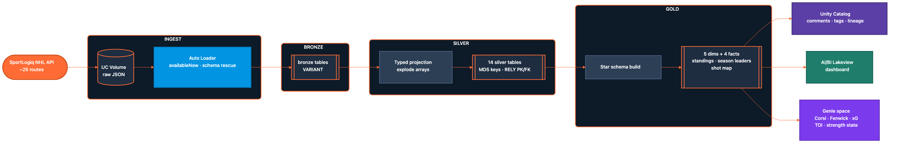
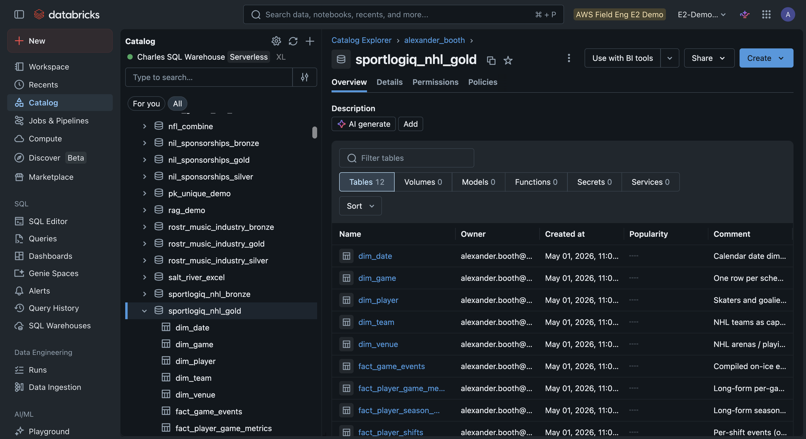
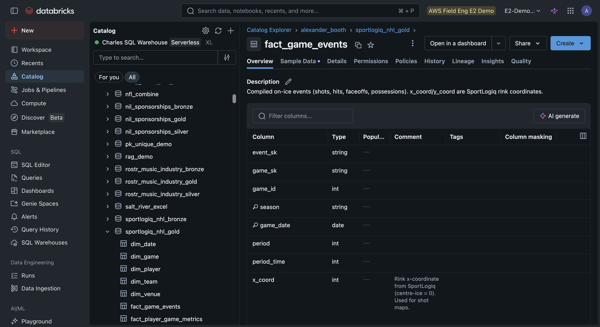
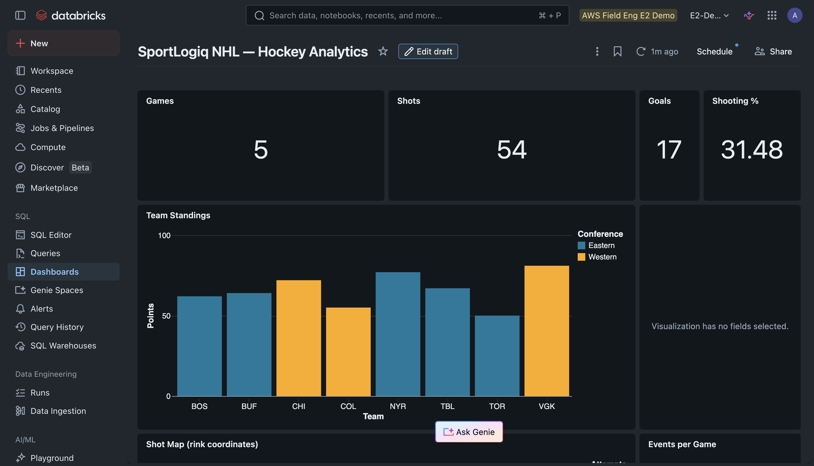
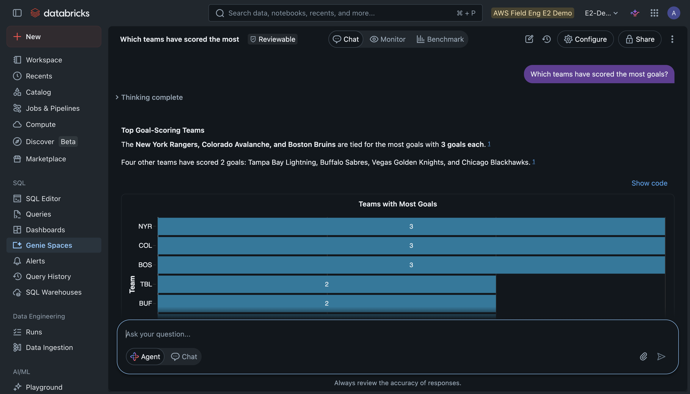

# From a Sports API to Self-Serve BI: A Governed Hockey Data Product on Databricks

*Ingest a hockey analytics API, land it through a medallion, model it as a star schema, and let a coach ask questions in plain English — all in one codebase.*

Every team in pro sports is sitting on the same problem. They pay for a great analytics feed. SportLogiq, Sportlogiq's competitors, the league's own tracking data. And then it just sits there, behind an API, waiting for someone technical enough to turn it into an answer.

The gap isn't the data, and it isn't the warehouse. It's the thing in between: the codebase that turns a raw JSON feed into governed tables, a dashboard the front office actually opens, and a question box a coach can type into without knowing what a JOIN is.

This demo is that thing in between, built on Databricks in eight notebooks. It takes the SportLogiq NHL API, runs it through a bronze-silver-gold medallion, shapes it into a star schema, and lands it in front of two consumers: an [AI/BI dashboard](https://docs.databricks.com/en/dashboards/index.html) and a [Genie](https://docs.databricks.com/en/genie/index.html) space that speaks hockey.



## Ingest: ~25 routes, four modes, fully resumable

The SportLogiq API is not one endpoint. It's rosters, events, shifts, time-on-ice, per-game metrics, season aggregates, and reference data. The first notebook pulls roughly 25 routes into a [Unity Catalog](https://docs.databricks.com/en/data-governance/unity-catalog/index.html) Volume as raw JSON, in whatever shape the API hands back.

Two things make it production-grade instead of a script. It runs in four modes (`daily`, `season`, `team`, `date_window`) so you can backfill a season or top up last night's games. And it's idempotent: every file already in the Volume is skipped, so a failed run resumes instead of restarting.

```python
def already_uploaded(path: str) -> bool:
    try:
        w.files.get_metadata(path)
        return True
    except Exception:
        return False

with ThreadPoolExecutor(max_workers=INGEST_WORKERS) as exe:
    futures = {exe.submit(ingest_game, gid): gid for gid in game_ids}
```

## Bronze: land everything as VARIANT

Bronze doesn't try to be smart. [Auto Loader](https://docs.databricks.com/en/ingestion/cloud-object-storage/auto-loader/index.html) reads each JSON file and stores the payload as a [`VARIANT`](https://docs.databricks.com/en/semi-structured/variant.html) column, with schema rescue turned on, so a new field in the feed never breaks ingestion.

```sql
spark.readStream.format("cloudFiles")
  .option("cloudFiles.format", "json")
  .option("cloudFiles.schemaEvolutionMode", "rescue")
  .load(source_path)
  .selectExpr("PARSE_JSON(TO_JSON(STRUCT(*))) AS data",
              "current_timestamp() AS _ingestion_timestamp",
              "_metadata.file_path AS _source_file")
  .writeStream.toTable(target_table)
```

VARIANT is the right call for a vendor feed you don't control. The API can add a field tomorrow, and Bronze just absorbs it. You decide later whether silver cares.

## Silver: typed tables, MD5 keys, and real constraints

Silver is where JSON becomes hockey. We pull known fields out of the VARIANT with dot-path syntax, explode the nested arrays (a game's roster, its events), and type everything into 14 clean tables.

```sql
SELECT
    MD5(CONCAT_WS('||', CAST(game_id AS STRING), crew.id)) AS roster_sk,
    crew.id::int AS person_id,
    crew.first_name, crew.last_name
FROM bronze_game_rosters
LATERAL VIEW EXPLODE(
    FROM_JSON(data:crew::string, 'ARRAY<STRUCT<id:STRING, first_name:STRING, ...>>')
) AS crew
```

The keys are MD5 surrogates derived from the natural keys, making every write deterministic. Re-run the notebook, and you get the same keys, so `INSERT OVERWRITE` is safe and idempotent. We also declare [primary and foreign keys](https://docs.databricks.com/en/tables/constraints.html) with `RELY`. They're informational, not enforced, but they do two valuable things for free: they render an ERD in Catalog Explorer, and they tell Genie how the tables join.

```sql
ALTER TABLE fact_game_events ADD CONSTRAINT fact_game_events_game_fk
    FOREIGN KEY (game_id) REFERENCES dim_game (game_id) RELY;
```

## Gold: a star schema any BI tool will love

Gold reshapes silver into a five-dimensional, four-fact star schema: `dim_team`, `dim_player`, `dim_venue`, `dim_game`, `dim_date,` feeding `fact_game_events`, `fact_player_shifts`, `fact_player_game_metrics`, and `fact_player_season_metrics`. On top of that sit three views that answer the most common questions directly: `v_team_standings`, `v_player_season_leaders`, and `v_shot_map`.

This is the layer where the hockey gets real. The metrics aren't toy columns. They're the ones analysts actually use: Corsi and Fenwick (shot-attempt differential, the standard possession proxies), expected goals, time-on-ice sliced by strength state (5v5, power play, penalty kill), zone classification, and rink x/y coordinates for shot maps.



*The gold layer in Unity Catalog: five dimensions, four facts, and the pre-aggregated views, all governed and discoverable.*

## Governance: comments, tags, lineage

The fifth notebook does the unglamorous work that makes a data product usable. It writes table and column comments (so `x_coord` says "SportLogiq rink coordinate, center-ice = 0"), applies tags (`domain=hockey_analytics`, `tier=gold`), and confirms column-level lineage from bronze through to gold.

That metadata isn't bureaucracy. Comments are what Genie reads to understand your schema, and lineage is what lets you trace a number on the dashboard back to the exact API field it came from.



*`fact_game_events` with its typed columns, comments, and RELY keys. The same metadata that renders the ERD is what Genie reads to join correctly.*

## Consume, part one: a dashboard as code

The sixth notebook builds an AI/BI dashboard entirely in JSON: nine widgets over six datasets. KPI counters for games, shots, goals, and shooting percentage. A standings bar. A season-leaders table. A shot-map heatmap. The whole dashboard is defined in the notebook and updated in place, so it lives in version control like everything else.

```python
datasets = [{
    "name": "kpi_summary",
    "queryLines": [
        "SELECT COUNT(DISTINCT game_id) AS games,",
        "       SUM(CASE WHEN is_goal THEN 1 ELSE 0 END) AS goals",
        f"FROM {G}.fact_game_events"]
}]
```



*The AI/BI dashboard, defined entirely as JSON in notebook 06: KPI counters, a conference-colored standings bar, a shot-map heatmap, and more.*

## Consume, part two: a Genie space that speaks hockey

The last notebook is the one that makes people lean in. It creates a Genie space over the gold tables and feeds it a block of hockey-specific instructions, so it understands the vocabulary without the user having to.

```python
"instructions": [
  "When users say 'team' or use a 3-letter code (BOS, TOR), match dim_team.team_shorthand.",
  "A 'shot' = is_shot = TRUE. A 'goal' = is_goal = TRUE. Shooting % = goals / shots.",
  "Strength state (5v5, 5v4, 4v5) lives on silver_player_toi.strength.",
  "Period structure: 1-3 regulation, 4 OT, 5 shootout."
]
```

Now, a coach types "top power-play time-on-ice players this season" and gets a table back, no SQL written. Genie knows that "power play" means a 5v4 strength state, that time-on-ice lives in the shifts data, and how to get there, because the instructions and the RELY constraints told it.



*Ask "which teams have scored the most goals?" in plain English; Genie writes the SQL, runs it, and charts the answer. No query language required.*

## The point

The flashy part of this demo is Genie answering hockey questions in plain English. The valuable part is everything underneath it.

A vendor API turned into governed, typed, lineage-tracked tables. Idempotent ingestion that resumes rather than restarts. A star schema that a dashboard and an LLM can both consume. None of that is hockey-specific. Point the first notebook at Genius Sports, Statcast, your ticketing system, or your CRM, and the rest of the pattern holds. The medallion, the governance, and the natural-language layer don't change.

That's what a data product looks like. The API was always there. This is how you make it answer questions.

---

*The full demo (eight notebooks, runnable locally via [Databricks Connect](https://docs.databricks.com/en/dev-tools/databricks-connect/index.html) or in-workspace) lives in the [sportslogiq-demo](https://github.com/ABoothInTheWild/databricks_demos/tree/main/sportslogiq-demo) directory. The demo runs against the SportLogiq API; all data shown here is synthetic, generated by the included generator for demonstration purposes.*
