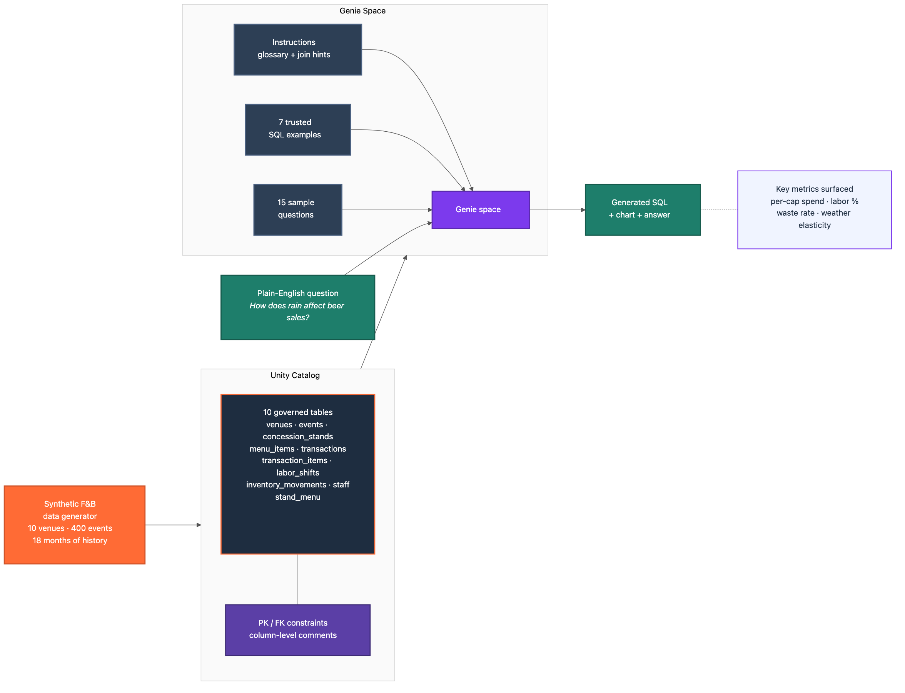
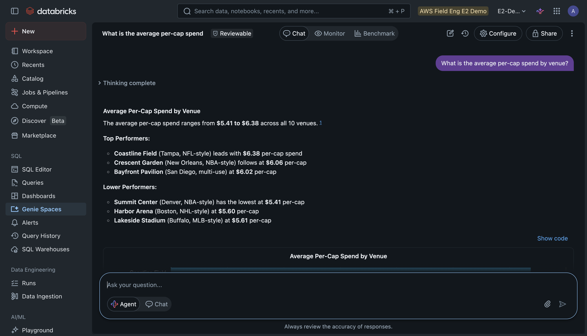
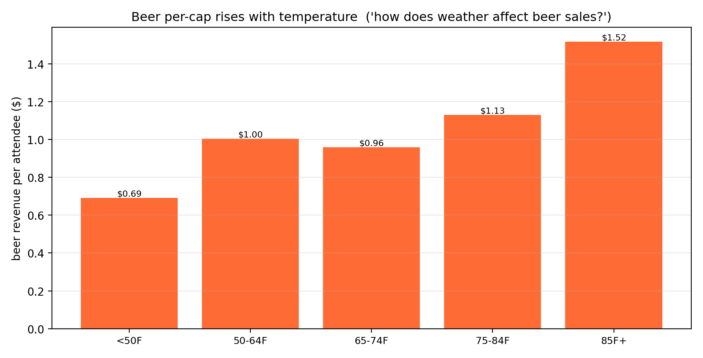
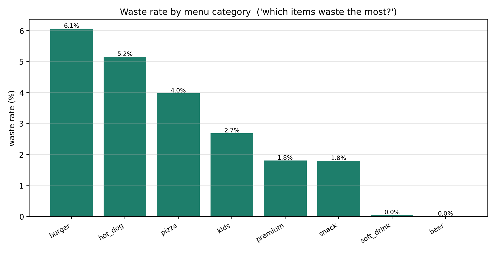

# Ask Your Stadium Concession Data in Plain English: Tuning Databricks Genie

*A venue ops manager shouldn't need SQL to ask "how does rain affect beer sales?" With a well-tuned Genie space, they don't.*

Walk into any stadium's operations office, and you'll find people who know their business cold and can't get a straight answer out of their data. Per-cap spend, waste rates, labor as a percentage of revenue, and how weather moves the concourse. The numbers exist. Getting them means filing a ticket and waiting for an analyst.

Databricks [Genie](https://docs.databricks.com/en/genie/index.html) closes that gap. Ask a question in plain English, get back SQL, a chart, and an answer. But Genie isn't magic, and that's the actual lesson of this demo. A raw Genie space pointed at raw tables gives mediocre answers. A *tuned* one gives great answers. The tuning is the work, and it's worth showing.



## The scenario: 10 venues, 18 months, real business logic

The dataset is synthetic, but it's not random. It models 10 sports venues over an 18-month season: 400 events, 60 menu items, 120 concession stands, and the transactions, labor shifts, and inventory that accompany them. No real team or venue names.

The important part is that the correlations are baked in. Heat drives beer sales. Rain suppresses spending. Weekends run hotter than weekdays. Fresh items waste more than packaged ones.

```python
base_rate    = 0.65
weather_mult = 1.0 + 0.005 * max(0, temp - 70) - 0.20 * min(precip, 1.0)
weekend_mult = 1.05 if is_weekend else 1.0
txn_rate     = base_rate * weather_mult * weekend_mult
```

That means the insights Genie surfaces are real signals, not artifacts of noise. When it tells you beer per capita climbs with temperature, it's because the data actually behaves that way.

## The data model: 10 governed tables

The data lands in [Unity Catalog](https://docs.databricks.com/en/data-governance/unity-catalog/index.html) as 10 normalized tables, documented with column comments and informational [PK/FK constraints](https://docs.databricks.com/en/tables/constraints.html). Venues, events (with weather and attendance), concession stands, menu items, transactions and their line items, staff, labor shifts, and inventory movements.

That metadata matters more than it looks. The column comments and key relationships are exactly what Genie reads to understand the schema. A good data model with good comments is half the tuning before you've written a single instruction.

*(The 10 tables and how they relate are laid out in the architecture diagram above.)*

## The tuning: instructions, glossary, and trusted SQL

Here's the heart of it. A Genie space gets three kinds of guidance, and each one fixes a specific failure mode.

**A glossary**, so business terms map to exact math. Per-cap is a notorious trap. The naive version divides total revenue by total attendance. The correct version computes it per event, then averages. You tell Genie that once.

```
"Per-cap" = revenue / attendance. Always compute at the event grain, then average.
"Labor %" = SUM(labor_shifts.labor_cost_usd) / SUM(transactions.total_usd) at event grain.
"Waste rate" = waste_qty / (sold_qty + waste_qty).
```

**Trusted SQL examples**, seven of them, each a canonical query for a common question. Genie treats these as templates. Ask something shaped like one, and it adapts the pattern instead of inventing a join.

```sql
-- Trusted example: weather's effect on beer sales
SELECT CASE WHEN e.temp_f >= 85 THEN '85F+'
            WHEN e.temp_f >= 75 THEN '75-84F' ELSE 'cooler' END AS temp_bucket,
       AVG(bs.beer_revenue / e.attendance) AS per_cap_beer
FROM events e JOIN beer_sales bs USING (event_id)
GROUP BY temp_bucket ORDER BY temp_bucket;
```

**Sample questions**, fifteen of them, that double as a test suite. Each one exercises a different join, filter, or aggregation. A space that answers all fifteen cleanly is a space you can trust in front of a stakeholder.

## The payoff

With that tuning in place, a venue manager just asks. Type "what is the average per-cap spend by venue?" and Genie does the rest. It knows per-cap means revenue over attendance, that it has to be computed at the event level and then averaged, and how to get there. It writes the SQL, runs it, and charts the answer.



*Genie turning plain English into governed SQL and a chart: per-cap from $5.41 at the smallest arena to $6.38 at the biggest stadium, computed at the event grain exactly as the glossary instructed.*

Ask about the weather and the relationship is just as clear. Beer sales track temperature.



*Beer revenue per attendee climbs from about $0.69 at cold games to $1.52 in the heat.*

The rest of the insights operators act on fall out the same way: per-cap by venue, labor as a share of revenue, and where margin leaks to waste.



*Waste rate by menu category. Freshly prepared food is where the margin leaks; packaged drinks barely move.*

## The point

The demo isn't really about stadium food. It's about what makes Genie good.

Genie is a lever, not an oracle. Point it at a clean, well-commented data model, hand it a glossary so your words map to exact math, give it a few trusted queries to pattern-match against, and it will answer questions a business user could never write SQL for. Skip that work, and it guesses. The data model and the instructions are the product. Genie is just the interface.

Swap stadium concessions for hospital throughput, retail baskets, or airline load factors, and the recipe is identical. Model it well, comment it well, tune the instructions, and let people ask.

---

*The full demo (data generator, schema enrichment, and the paste-ready Genie configuration) lives in the [`stadium-fnb-genie`](https://github.com/ABoothInTheWild/databricks_demos/tree/main/stadium-fnb-genie) directory. All venue, event, and sales data is entirely synthetic and generated locally for demonstration.*
