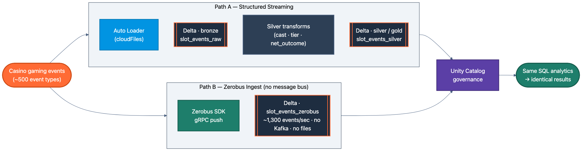
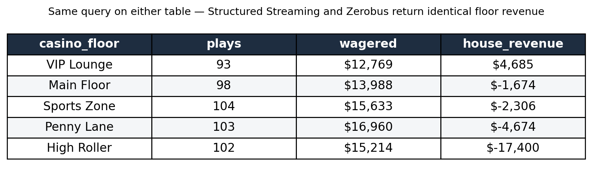

# Streaming Without Kafka: Structured Streaming vs. Zerobus Ingest on Databricks

*One casino floor, 500 events, two architectures — and why, for single-destination flows, you can drop the message bus entirely.*

Every real-time pipeline starts with the same fork in the road. Stand up Kafka and pay the operational tax (brokers, partitions, scaling, security), or fall back to batch and eat the latency. For years, those were the choices.

This demo runs a third option alongside the classic one on the same data, so you can see the difference. The data is from a casino gaming floor: 500 machine events across five floors and five game types. One path ingests it in the established way, with [Structured Streaming](https://docs.databricks.com/en/structured-streaming/index.html) and [Auto Loader](https://docs.databricks.com/en/ingestion/cloud-object-storage/auto-loader/index.html). The other pushes it straight into [Delta](https://docs.databricks.com/en/delta/index.html) with [**Zerobus Ingest**](https://docs.databricks.com/en/ingestion/zerobus-overview.html), the gRPC ingestion path that went GA in February. No Kafka. No file staging. Just source to lakehouse.



## The classic path: Structured Streaming

The first half is the medallion architecture that you know. Auto Loader reads JSON events as they land and streams them into a bronze Delta table.

```python
raw = (spark.readStream.format("cloudFiles")
    .option("cloudFiles.format", "json")
    .option("cloudFiles.schemaLocation", f"{CHECKPOINT}/schema")
    .load(VOLUME_PATH))
(raw.writeStream.format("delta")
    .option("checkpointLocation", CHECKPOINT)
    .trigger(availableNow=True).toTable(BRONZE_TABLE))
```

The same notebook shows the Kafka version commented right beside it, because the beauty of Structured Streaming is that the source is swappable: change `cloudFiles` to `kafka` and the rest of the pipeline doesn't move.

```python
raw = (spark.readStream.format("kafka")
    .option("kafka.bootstrap.servers", "your-broker:9092")
    .option("subscribe", "slot_events").load())
```

Then the transforms run in flight: cast types, compute net outcome, tier the bets, flag wins, and land a clean silver table.

```python
silver = (bronze
    .withColumn("net_outcome", F.round(F.col("win_amount") - F.col("bet_amount"), 2))
    .withColumn("bet_tier", F.when(F.col("bet_amount") < 10, "Low")
        .when(F.col("bet_amount") < 100, "Medium").otherwise("High")))
```

This is what Structured Streaming is good at: complex, multi-step ETL, in motion, with exactly-once checkpoints. If you need to reshape the data on the way in, this is the path.

## The new path: Zerobus, straight to Delta

The second half does the same job with a fraction of the machinery. Zerobus opens a gRPC stream and pushes records directly into a Delta table.

```python
sdk = ZerobusSdk(SERVER_ENDPOINT, WORKSPACE_URL)
stream = sdk.create_stream(CLIENT_ID, CLIENT_SECRET, table_props, options)
for i in range(NUM_EVENTS):
    stream.ingest_record_offset(generate_event(base_time))
stream.flush(); stream.close()
```

There's no broker, no topic, no file landing zone. The producer talks to one endpoint, and the rows appear in the lakehouse with a durability guarantee for each record. In this demo, it pushed all 500 events in **0.4 seconds, about 1,300 events a second**, with sub-five-second latency end to end.

The catch, and it's the important one: Zerobus ingests, it doesn't transform. The data lands raw. You do your typing and your business logic afterward, in silver, exactly like the first path's bronze-to-silver step.

## Same data, same answers

Here's the part that makes the comparison fair. Run the same analytics query against both tables, and you get the same results.

```sql
SELECT casino_floor, COUNT(*) AS plays,
       ROUND(SUM(bet_amount) - SUM(win_amount), 2) AS house_revenue
FROM slot_events  -- works on the streaming table OR the zerobus table
GROUP BY casino_floor ORDER BY house_revenue DESC
```

Both paths agree the VIP Lounge cleared about $4,700 for the house while the High Roller floor lost $17,400 to a few big nights. Both rank the machines the same way. The two ingestion routes are functionally equivalent for this data. The difference is entirely in the plumbing that got it there.


*The same grouped query, run against the Structured Streaming silver table and the Zerobus table, returns the same numbers. The routes differ; the results don't.*

## Which one, when

The decision is simpler than the Kafka-or-batch one it replaces.

Reach for **Structured Streaming** when you need to transform data in flight, join streams, or when your source is Kafka, and you want the unified source abstraction. It's the right tool for complex streaming ETL.

Reach for **Zerobus** when the job is high-velocity ingestion into the lakehouse and nothing more: IoT and sensor telemetry, gaming-floor events, clickstream, app events. All the cases where the data has exactly one destination and a message bus in the middle are overhead you were paying out of habit.

For a large share of real-time pipelines, the honest answer is that you never needed the broker. That's the point of this demo. Same floor, same numbers, one fewer system to run.

---

*The full demo (both pipelines, runnable on [Databricks Serverless](https://docs.databricks.com/en/compute/serverless.html)) lives in the [`streaming-demo`](https://github.com/ABoothInTheWild/databricks_demos/tree/main/streaming-demo) directory. The casino gaming data is entirely synthetic and generated locally for demonstration.*
