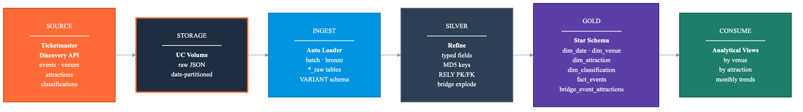
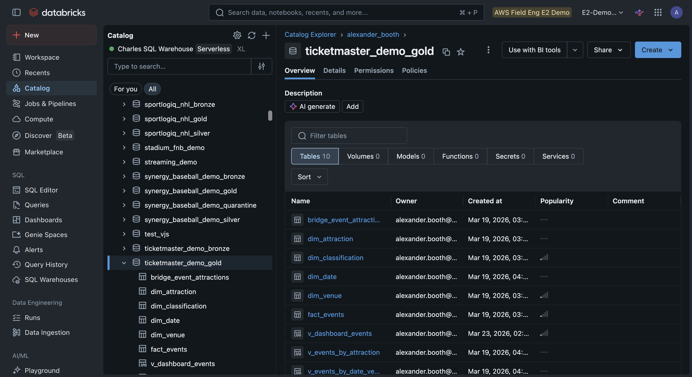
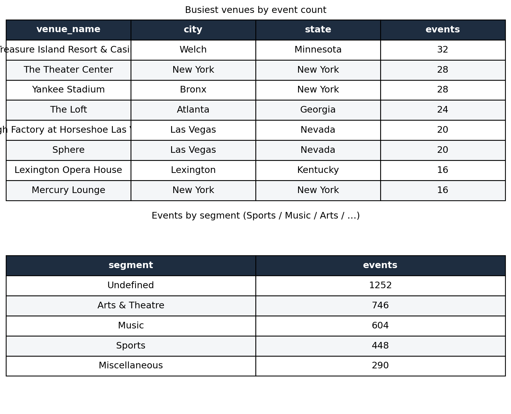

# Every Event, One Star Schema: An Events Analytics Pipeline from the Ticketmaster API

*Pull a public events API, run it through a medallion, and land a governed star schema you can actually query — bronze to gold in five notebooks.*

Yankee Stadium, the Sphere in Las Vegas, and a 2,000-seat theater in Atlanta. They all show up in the same place: the public Ticketmaster Discovery API. Every event, every venue, every act, free to pull.

The catch is that a public API is not an analytics platform. It hands you paginated JSON, not a star schema. Turning one into the other, cleanly and governed and query-ready, is the actual work. And it's the same work whether you run a stadium, a venue network, or the business side of a sports team.

This demo does exactly that on Databricks, in five notebooks. About 4,800 events from the live API, through a bronze-silver-gold [medallion](https://docs.databricks.com/en/lakehouse/medallion.html), into a relational star schema with real keys, constraints, and views.



## Ingest: a public API, paginated politely

The Discovery API is paginated and rate-limited, so the first notebook pulls events, venues, attractions, and classifications with a small client that walks the pages and backs off between calls. The raw JSON lands in a [Unity Catalog Volume](https://docs.databricks.com/en/volumes/index.html), untouched and partitioned by date.

```python
def fetch_paginated(self, endpoint, page_size=200, max_pages=None, params=None):
    all_items, page = [], 0
    while True:
        if max_pages and page >= max_pages: break
        resp = requests.get(f"{self.base_url}{endpoint}",
                            params={"apikey": self.api_key, "size": page_size, "page": page, **(params or {})},
                            timeout=30)
        resp.raise_for_status(); data = resp.json()
        items = data.get("_embedded", {}).get(self._items_key(endpoint), [])
        if not items: break
        all_items.extend(items)
        if page >= data.get("page", {}).get("totalPages", 1) - 1: break
        page += 1; time.sleep(0.2)   # be polite to the API
    return all_items
```

Land it raw, decide what it means later. That separation is the whole point of a medallion.

## Bronze: land everything as VARIANT

[Auto Loader](https://docs.databricks.com/en/ingestion/cloud-object-storage/auto-loader/index.html) reads the landed JSON in batch mode and stores each payload as a [`VARIANT`](https://docs.databricks.com/en/semi-structured/variant.html) column, with ingestion metadata alongside.

```python
(spark.readStream.format("cloudFiles")
    .option("cloudFiles.format", "json")
    .option("cloudFiles.schemaLocation", checkpoint + "/_schema")
    .load(source_path)
    .selectExpr("PARSE_JSON(TO_JSON(STRUCT(*))) AS data",
                "current_timestamp() AS _ingestion_timestamp",
                "_metadata.file_path AS _source_file")
    .writeStream.option("checkpointLocation", checkpoint)
    .trigger(availableNow=True).toTable(target_table))
```

A public API you don't control will eventually add or rename fields. VARIANT means that day is a non-event for bronze.

## Silver: typed, deduplicated, and constrained

Silver is where JSON becomes a data model. We pull the known fields out of the VARIANT by dot-path, type them, and build MD5 surrogate keys so every write is deterministic and `INSERT OVERWRITE` is safe to re-run.

```sql
INSERT OVERWRITE silver.venues
SELECT
    MD5(data:id::string)               AS venue_sk,
    data:id::string                    AS venue_id,
    data:name::string                  AS venue_name,
    data:city.name::string             AS city,
    data:state.stateCode::string       AS state,
    data:location.latitude::double     AS latitude,
    data:location.longitude::double    AS longitude
FROM bronze.venues_raw
WHERE data:id IS NOT NULL
```

We declare primary and foreign keys with [`RELY`](https://docs.databricks.com/en/tables/constraints.html) (informational; they render an ERD in [Catalog Explorer](https://docs.databricks.com/en/catalog-explorer/index.html) and help the optimizer), turn on [liquid clustering](https://docs.databricks.com/en/delta/clustering.html), and explode the event-to-attraction arrays into a bridge table because one festival has many acts.

## Gold: a star schema any BI tool will love

Gold reshapes silver into a textbook star: a pre-generated `dim_date` (2024 through 2027), Type 1 dimensions for venue, attraction, and classification, a `fact_events` table at one row per event, and a `bridge_event_attractions` table for the many-to-many. On top sit three analytical views, so a business user never has to write a join.

```sql
CREATE TABLE fact_events (
    event_sk STRING NOT NULL, date_sk_fk INT, venue_sk_fk STRING,
    classification_sk_fk STRING, event_date DATE, price_min DOUBLE, price_max DOUBLE, status_code STRING
) CLUSTER BY (date_sk_fk, venue_sk_fk);

ALTER TABLE fact_events ADD CONSTRAINT fact_events_venue_fk
    FOREIGN KEY (venue_sk_fk) REFERENCES dim_venue (venue_sk);
```


*The gold layer: one fact table radiating to date, venue, attraction, and classification dimensions, with a bridge for events that have multiple acts.*

## Analyze: what the feed actually says

The last notebook is just questions, answered with fact-to-dimension joins. They land immediately.

```sql
SELECT v.venue_name, v.city, v.state, COUNT(*) AS events
FROM fact_events f JOIN dim_venue v ON f.venue_sk_fk = v.venue_sk
GROUP BY ALL ORDER BY events DESC LIMIT 5
```

Yankee Stadium and a Vegas casino top the venue list. The segment split is the interesting part for a sports audience: of ~4,800 events, 448 are tagged Sports, 604 Music, 746 Arts & Theatre, and a large "Undefined" bucket that's a data-quality story in its own right.


*Two of the ten sample queries: busiest venues, and the event mix by segment. Filter `fact_events` to the Sports segment and you have every game in the feed, across every venue.*

Filter to Sports and the familiar names show up: the Toronto Blue Jays, WWE, each appearing across multiple dates and cities. The same pattern works for any segment, any geography, any price band, because the grain is one clean row per event.

## The point

The events data was public the whole time. The value isn't the data, it's the governed star schema around it: deduplicated, typed, constrained, query-ready, and lineage-tracked from the API call down to the view.

And none of it is Ticketmaster-specific. Point the first notebook at your own ticketing feed, your CRM, or a partner's events API, and the medallion and the star schema hold. That's what makes it an accelerator instead of a one-off: the hard part is built, and only the first notebook knows where the data came from.

---

*The full demo (five notebooks, runnable locally via [Databricks Connect](https://docs.databricks.com/en/dev-tools/databricks-connect/index.html)) lives in the [`ticketmaster-event-analytics`](https://github.com/ABoothInTheWild/databricks_demos/tree/main/ticketmaster-event-analytics) directory. It runs against the public Ticketmaster Discovery API; bring your own API key.*
