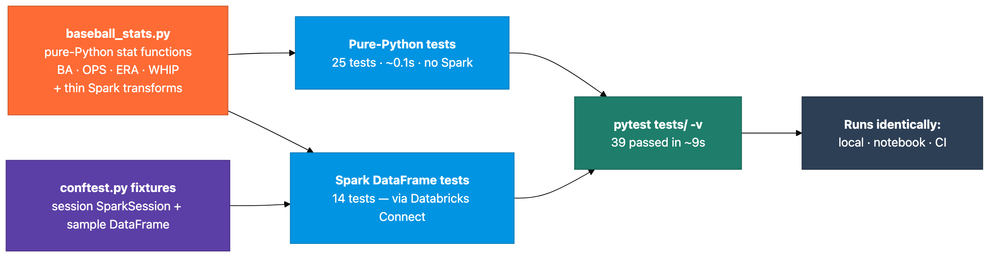
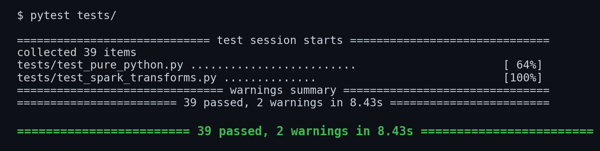

# Test Your PySpark Like Real Software: pytest, Fixtures, and Databricks Connect

*Separate the math from the Spark, test both locally before they hit production, and run the exact same suite on your laptop, in a notebook, and in CI.*

Most data bugs don't announce themselves. A rounding step goes missing, an aggregation drops a column, an edge case divides by zero, and nobody notices until a dashboard is quietly wrong a week later. The fix isn't heroics. It's the thing application engineers have done for decades: write tests, run them before you ship.

This demo shows how to do that properly for PySpark with [pytest](https://docs.pytest.org/en/stable/) and [Databricks Connect](https://docs.databricks.com/en/dev-tools/databricks-connect/index.html). The example domain is baseball stats (batting average, OPS, ERA, WHIP) because the math is familiar and the edge cases are obvious. The domain is incidental, though. Swap in marketing metrics, financial ratios, or supply-chain KPIs, and the structure is identical. What matters is the pattern.



## The key move: separate the math from the Spark

The whole approach rests on one decision. Keep your domain logic in plain Python functions, and keep your Spark transformations thin. Here's a pure function and the Spark transform that uses the same idea:

```python
def batting_average(hits: int, at_bats: int) -> float:
    if at_bats == 0:            # the edge case that bites in production
        return 0.0
    return round(hits / at_bats, 3)

def add_batting_average(df: DataFrame) -> DataFrame:
    return df.withColumn("batting_avg",
        F.when(F.col("at_bats") == 0, 0.0)
         .otherwise(F.round(F.col("hits") / F.col("at_bats"), 3)))
```

The math lives where it's cheap to test. The Spark code is a thin shell around it.

## Layer one: pure-Python tests that run in milliseconds

Pure functions require no Spark at all, so they test instantly. This is your fastest feedback loop: break the formula, and you know before the kettle boils.

```python
def test_normal_calculation(self):
    assert batting_average(150, 500) == 0.300

def test_zero_at_bats_returns_zero(self):
    assert batting_average(0, 0) == 0.0   # no crash, no NaN
```

Twenty-five of these run in about a tenth of a second.

## Layer two: Spark tests over Databricks Connect

The transformations need a real SparkSession, so those tests run against Databricks via Connect. They build a tiny, known DataFrame, run the transform, and assert on the result.

```python
def test_correct_calculation(self, sample_batting_df):
    result = add_batting_average(sample_batting_df)
    trout = result.filter(result.player == "Mike Trout").collect()[0]
    assert trout.batting_avg == 0.327
```

Small, controlled data (six rows, not production tables) keeps them fast and deterministic.

## The fixtures: set up once, inject everywhere

This is the heart of pytest. A session-scoped [fixture](https://docs.pytest.org/en/stable/how-to/fixtures.html) creates the Spark session once and shares it across all tests, so you pay the startup cost once, not per test.

```python
@pytest.fixture(scope="session")
def spark():
    session = DatabricksSession.builder.serverless(True).getOrCreate()
    yield session
    session.stop()
```

Another fixture builds the sample DataFrame. Tests just declare `sample_batting_df` as an argument, and pytest wires it in. No imports, no boilerplate.

## Run it everywhere

The same `tests/` directory runs three ways with no code changes: `pytest tests/ -v` from your laptop, `pytest.main([...])` in a notebook cell, and the identical command in a [GitHub Actions](https://docs.github.com/en/actions) job. Thirty-nine tests, twenty-five pure-Python and fourteen Spark, pass in about nine seconds, and most of that is the one-time Spark session.

```
$ pytest tests/ -v
...
39 passed in 9.34s
```


*The whole suite runs locally: 25 pure-Python tests and 14 Spark tests, 39 passed in under nine seconds.*

## The point

Once the suite is green on six rows of fake data, you trust the same transforms on a billion real ones, because the logic is proven independent of scale. Change a formula and forget a rounding step, and the test fails immediately. Refactor an aggregation and drop a column; the test catches it before the dashboard does.

The baseball is just a vessel. The reusable parts are split between pure logic and Spark, the session fixture, and the run-anywhere setup. Copy the `conftest.py`, replace the stat functions with your own domain, and you've got a testing template that turns "I think this works" into "the suite says it works."

---

*The full demo (the functions, the tests, and four explainer notebooks) lives in the [`unit-testing-pyspark`](https://github.com/ABoothInTheWild/databricks_demos/tree/main/unit-testing-pyspark) directory. The baseball stats are illustrative; the testing pattern is domain-agnostic.*
